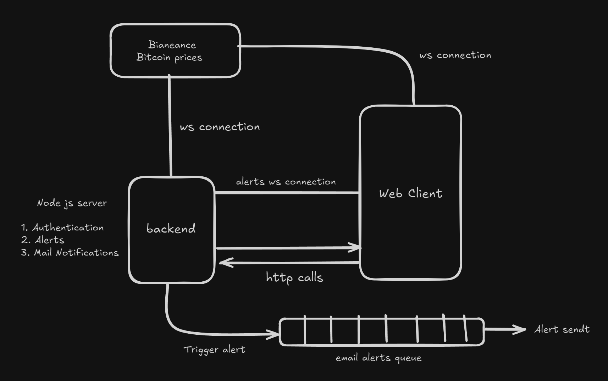

# Alerting system for Bitcoin price
The Bitcoin Alert System is a comprehensive web application designed to provide real-time notifications for Bitcoin price movements.

# Features
1. **User Authentication**: Secure user registration and login system to protect user data and personalize the alert experience.
2. **Custom Bitcoin Price Alerts**: Users can create and manage custom price alerts for Bitcoin. They have the flexibility to set specific price points and cancel alerts as needed.
3. **Real-Time Price Monitoring**: Utilizes Binance WebSocket to stream live Bitcoin price data, ensuring up-to-the-second accuracy in price tracking.
4. **Instant Alert Notifications**: When the Bitcoin price approaches a user's set alert price, the system triggers immediate email notifications to keep users informed of market movements.
5. **Live Alert Updates**: Implements a custom WebSocket for real-time updates of alerts on the frontend, providing users with an interactive and responsive interface.
6. **Optimized Performance**:
    - Utilizes Node.js caching on the backend to minimize database queries and improve alert triggering efficiency.
    - Implements a message queue system for email notifications to handle high volumes of alerts without compromising system performance.
      
# Techstack
- **Backend**: Node.js with Express.js
- **Frontend**: React.js
- **Real-Time Communication**: WebSocket (Binance API and custom implementation)
- **Database**: MongoDB
- **Caching**: Node.js in-memory cache

# Screenshots

<!--  -->
<!--  -->
<!--  -->

